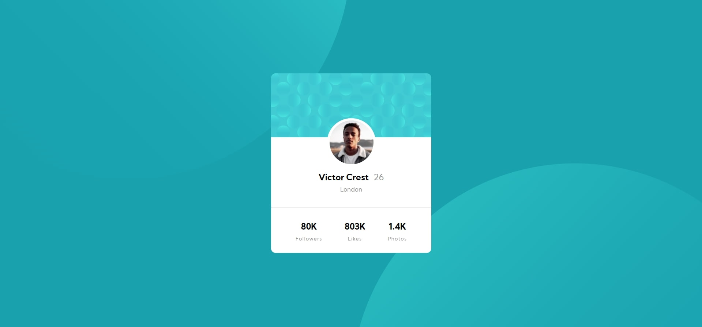

# profile-card-component-main

## Table of contents
- [Objective](#objective)
  - [Design](#design)
- [Layout](#layout)
  - [Desktop-Layout](#desktop-layout)
- [Website link](#website-link)
- [Programming Process](#programming-process)
  - [Built With](#built-with)
  - [Website Structure](#website-structure)
  - [Extra Features](#extra-features)
    
  

## Objective
   Build a 3-column component that changes depending on the layout size and match the given design
   
   ### Design
   
   

## Layout
  ### Desktop-Layout
  
  
## Website link
  Live Site URL : [Live Site](https://alad2121.github.io/profile-card-component-main/)
  
  
## Programming Process
  ### Built With
   - Semantic HTML5 markup
   - Sass
   - GSAP(JS Animation Library)
  
  ### Website Structure
   I wasn't given any dimensions from the given design and i had to test out different values to make it close to looking like the design file
   
   
  ### Extra Features
   After I finished with designing the website to match the given design, i decided to add animations. I've done this by adding more CSS properties and by using GSAP.
 
